# paper-video

该仓库保存了博士学位论文《考虑周车预测不确定性的矿区无人驾驶运动规划方法》中一些仿真测试而视频记录结果。

## 1. 多静态障碍物场景路径生成算法仿真实验

> 对应论文章节：《3.5.2 多静态障碍物场景路径生成算法仿真实验》

（1）论文单帧结果：

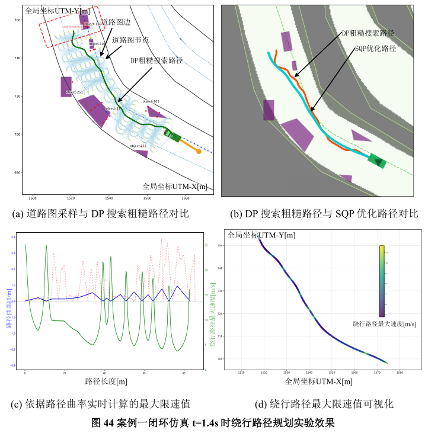

（2）道路图采样与动态规划（DP）搜索的初始路径效果如下：

以下是测试的演示视频：

## 2. 时空联合轨迹规划算法仿真实验

> 对应论文章节《3.5.3 时空联合轨迹规划算法仿真实验》

### （1 ）场景一： 与有人驾驶车辆 会车场景。

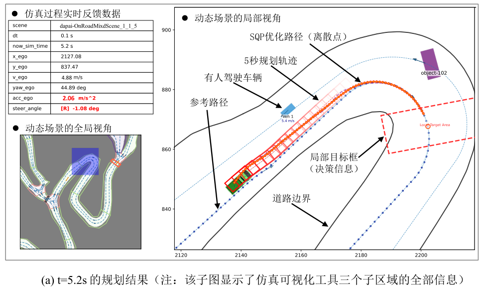

以下是测试的演示视频：

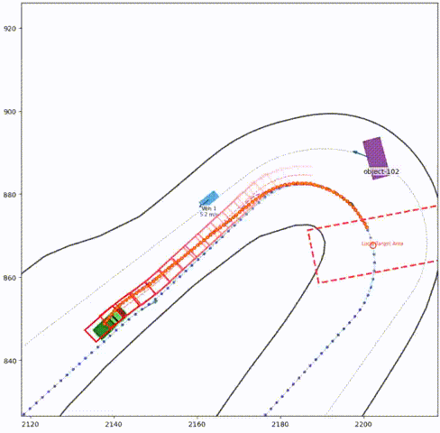

### （2）场景二： 弯道路复杂动静态障碍物交互冲突场景。

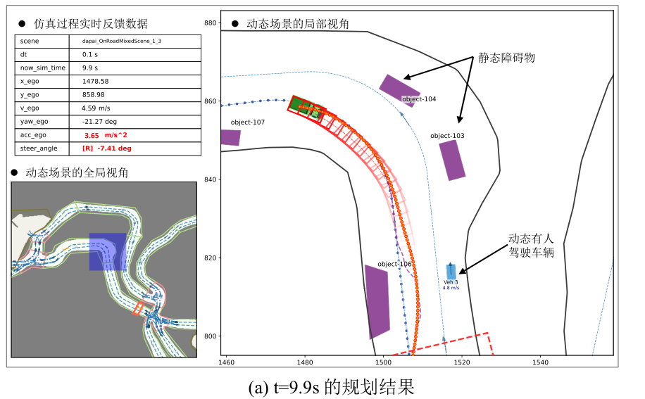

以下是测试的演示视频：

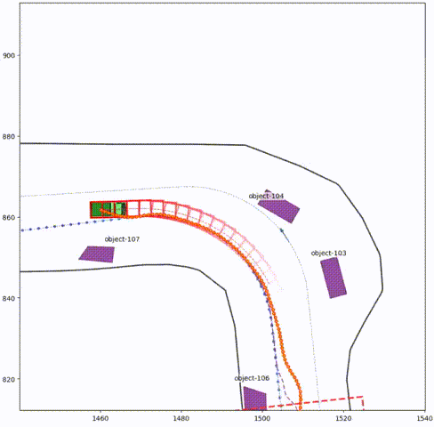

### （3）场景三：直行路段多车交互冲突场景。

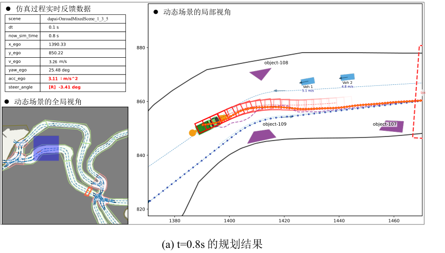

以下是测试的演示视频：

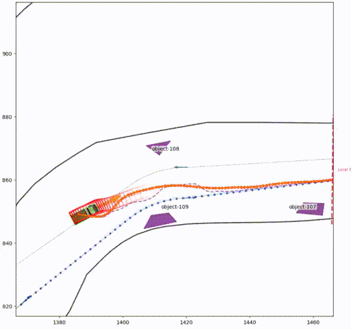

## 3. 路口混行场景规划算法仿真实验

> 对应论文章节《4.5.2.2 矿区路口混行场景多分支轨迹树规划仿真实验》

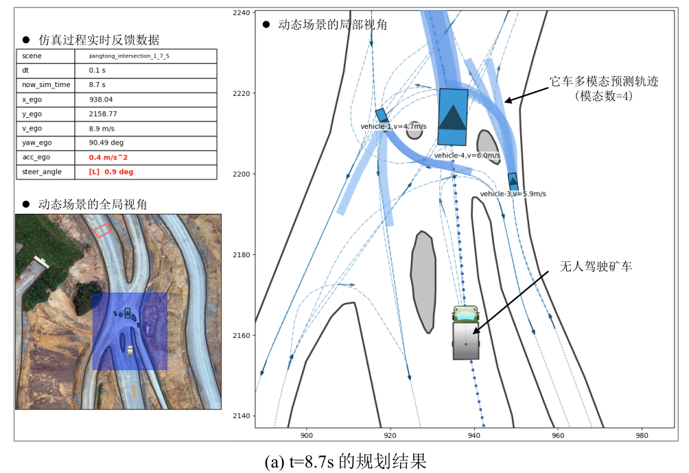

以下是测试的演示视频：

## 4. 静态障碍物绕行场景规划算法实车测试

> 对应论文章节《5.4.2 静态障碍物绕行场景规划算法实车测试》

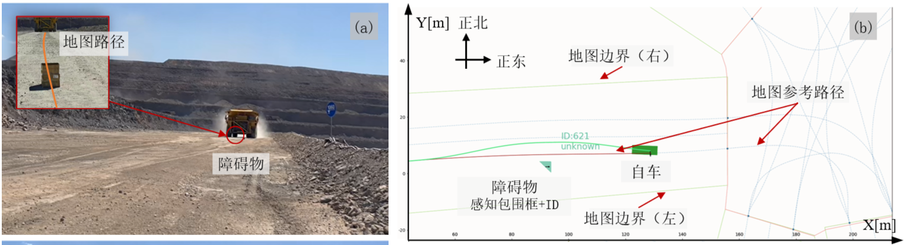

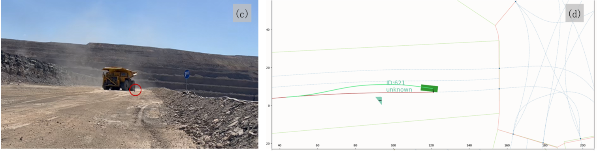

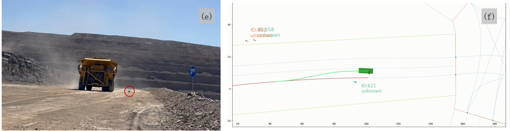

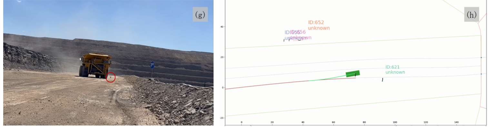

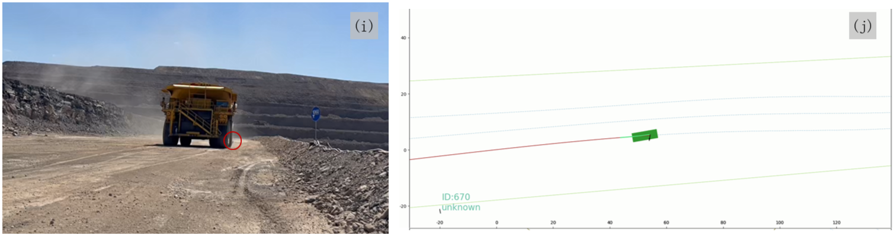

以下是测试的演示视频：

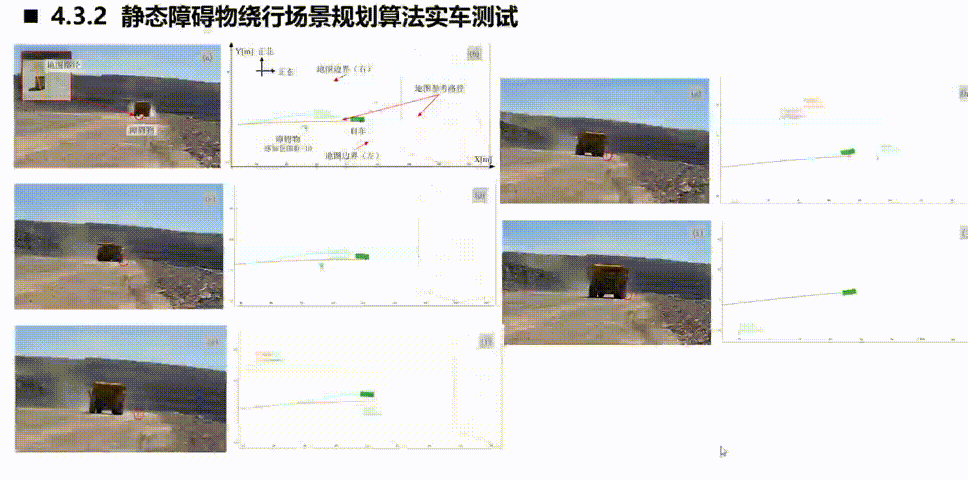
